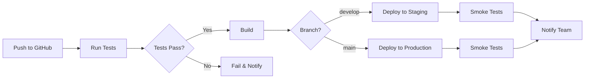

# Розділ 15: Release Process & Deployment

**Версія:** 1.0  
**Дата:** 27 січня 2026  
**Власник:** DevOps & Engineering Team  

---

## 15.1. Executive Summary

**Мета:** Визначити процес випуску нових версій продукту — від development до production.

**Ключові Принципи:**
- 🚀 **Ship fast, ship often** (але без багів)
- 🔄 **Continuous deployment** (автоматизація)
- 🛡️ **Safety first** (rollback готовий завжди)
- 📊 **Data-driven** (моніторинг після релізу)

**Release Cadence:**
- **Hotfixes:** As needed (критичні баги)
- **Minor releases:** Weekly (нові features, bug fixes)
- **Major releases:** Monthly (великі features, breaking changes)

---

## 15.2. Versioning Strategy

### 📌 Semantic Versioning (SemVer)

**Format:** `MAJOR.MINOR.PATCH` (e.g., `1.3.2`)

**Rules:**
- **MAJOR:** Breaking changes (API змінюється, не backward compatible)
- **MINOR:** New features (backward compatible)
- **PATCH:** Bug fixes (backward compatible)

**Examples:**
- `1.0.0` → MVP launch
- `1.1.0` → Додано invoice generation
- `1.1.1` → Виправлено баг з календарем
- `2.0.0` → Redesign UI (breaking changes)

**Pre-release versions:**
- `1.2.0-beta.1` → Beta testing
- `1.2.0-rc.1` → Release candidate

---

## 15.3. Branching Strategy (Git Flow)

### 🌿 Branch Types

```
main (production)
  ↑
  └── release/v1.2.0 (staging)
        ↑
        └── develop (integration)
              ↑
              ├── feature/invoice-gen
              ├── feature/calendar-sync
              └── bugfix/login-error
```

**Branches:**

**1. `main`** (production)
- Always deployable
- Protected (no direct commits)
- Auto-deploys to production

**2. `develop`** (integration)
- Latest features
- Auto-deploys to staging
- Merge from feature branches

**3. `feature/*`** (new features)
- Branch from `develop`
- Naming: `feature/invoice-generation`
- PR → `develop`

**4. `bugfix/*`** (non-critical bugs)
- Branch from `develop`
- Naming: `bugfix/calendar-display`
- PR → `develop`

**5. `hotfix/*`** (critical bugs in production)
- Branch from `main`
- Naming: `hotfix/login-crash`
- PR → `main` AND `develop`
- Immediate deploy

**6. `release/*`** (release preparation)
- Branch from `develop`
- Naming: `release/v1.2.0`
- No new features (only bug fixes)
- PR → `main` (creates release)

---

### 🔄 Workflow Example

**New Feature:**
```bash
# 1. Create feature branch
git checkout develop
git pull
git checkout -b feature/invoice-gen

# 2. Develop + commit
git add .
git commit -m "feat: add invoice generation"

# 3. Push and create PR
git push origin feature/invoice-gen
# Create PR: feature/invoice-gen → develop

# 4. After review, merge to develop
# Auto-deploys to staging

# 5. Test on staging
# If OK → create release branch
```

**Release:**
```bash
# 1. Create release branch
git checkout develop
git pull
git checkout -b release/v1.2.0

# 2. Update version (package.json)
# 3. Update CHANGELOG.md
# 4. Commit
git commit -m "chore: release v1.2.0"

# 5. Create PR: release/v1.2.0 → main
# After approval, merge → auto-deploy to production
```

**Hotfix:**
```bash
# 1. Create hotfix branch
git checkout main
git pull
git checkout -b hotfix/login-crash

# 2. Fix bug
git commit -m "fix: resolve login crash"

# 3. PR → main (urgent)
# Also create PR → develop (to keep in sync)
```

---

## 15.4. Deployment Environments

### 🌍 Environment Setup

| Environment | Branch | URL | Purpose | Auto-Deploy |
|-------------|--------|-----|---------|-------------|
| **Local** | any | localhost:3000 | Development | No |
| **Staging** | develop | staging.justio.ua | Testing | Yes |
| **Production** | main | justio.ua | Live users | Yes (with approval) |

---

### 🚀 Deployment Pipeline (CI/CD)

**Vercel + GitHub Actions**

**Pipeline Steps:**



**GitHub Actions Config:**
```yaml
name: Deploy

on:
  push:
    branches: [main, develop]
  pull_request:

jobs:
  test:
    runs-on: ubuntu-latest
    steps:
      - uses: actions/checkout@v3
      - uses: actions/setup-node@v3
      - run: npm ci
      - run: npm test
      - run: npm run build

  deploy-staging:
    needs: test
    if: github.ref == 'refs/heads/develop'
    runs-on: ubuntu-latest
    steps:
      - uses: vercel/actions@v2
        with:
          vercel-token: ${{ secrets.VERCEL_TOKEN }}
          vercel-org-id: ${{ secrets.VERCEL_ORG_ID }}
          vercel-project-id: ${{ secrets.VERCEL_PROJECT_ID }}
          env: staging

  deploy-production:
    needs: test
    if: github.ref == 'refs/heads/main'
    runs-on: ubuntu-latest
    steps:
      - uses: vercel/actions@v2
        with:
          vercel-token: ${{ secrets.VERCEL_TOKEN }}
          env: production
          # Requires manual approval (GitHub Environments)
```

---

### 🔒 Deployment Approval

**Production Deploys:**
- Require manual approval (GitHub Environments)
- Approvers: Tech Lead + Product Owner
- Approval window: 1 hour (then auto-reject)

**Staging Deploys:**
- Auto (no approval needed)

---

## 15.5. Pre-Release Checklist

### ✅ Before ANY Release to Production

**Code Quality:**
- [ ] All tests pass (unit + integration + E2E)
- [ ] Code reviewed (min 1 approval)
- [ ] No lint errors
- [ ] No console.logs or debugger statements
- [ ] Secrets not in code (use env vars)

**Testing:**
- [ ] Manual testing on staging (critical paths)
- [ ] No P0/P1 bugs
- [ ] Performance benchmarks met (Lighthouse >90)
- [ ] Cross-browser tested (Chrome, Safari, Firefox)
- [ ] Mobile tested (iPhone, Android)

**Documentation:**
- [ ] CHANGELOG.md updated
- [ ] API docs updated (if API changes)
- [ ] User-facing docs updated (if UI changes)

**Data & Security:**
- [ ] Database migrations tested (if any)
- [ ] No breaking changes (or communicated to users)
- [ ] Security scan passed (npm audit, OWASP ZAP)

**Communication:**
- [ ] Release notes prepared
- [ ] Team notified (Slack)
- [ ] Support team briefed (if major changes)
- [ ] Users notified (if breaking changes)

---

## 15.6. Release Process Step-by-Step

### 📝 Process Walkthrough

**Week Before Release:**
1. Feature freeze (no new features)
2. Bug fixing only
3. QA full regression testing

**2 Days Before:**
1. Create release branch (`release/v1.2.0`)
2. Deploy to staging
3. Final testing (smoke tests)
4. Prepare release notes

**Release Day:**
1. **Morning (9 AM):**
   - Final check: all tests pass?
   - Get approvals (Tech Lead, PO)
   - Merge release → main
   
2. **Auto-deploy to production** (via Vercel)
   - Deployment time: ~5 minutes
   
3. **Immediate Post-Deploy (9:10 AM):**
   - Run smoke tests (critical paths)
   - Check Sentry (no new errors?)
   - Monitor server metrics (CPU, memory)
   
4. **First Hour (9-10 AM):**
   - Watch for user reports
   - Monitor error rates
   - Check support tickets
   
5. **If All OK (10 AM):**
   - Tag release in GitHub (`v1.2.0`)
   - Publish release notes
   - Notify team in Slack
   - Email users (if major release)
   
6. **If Issues:**
   - See Rollback procedure (section 15.7)

---

### 📢 Release Communication

**Internal (Slack):**
```markdown
🚀 Release v1.2.0 Deployed to Production

**What's New:**
- Invoice generation
- Calendar sync with Google
- Bug fixes: #123, #456

**Monitor:** https://sentry.io/justio
**Status:** https://status.justio.ua

@channel
```

**External (Users):**
```markdown
Subject: New Feature: Invoice Generation 🎉

Hi [Name],

We've just released v1.2.0 with some exciting updates:

✨ What's New:
- Generate professional invoices in 2 clicks
- Sync calendar with Google Calendar
- Faster document upload (50% improvement)

🐛 Bug Fixes:
- Resolved calendar display issue
- Fixed notification timing

Questions? Contact support@justio.ua

Happy lawyering!
Justio Team
```

---

## 15.7. Rollback Procedure

### ⏪ When to Rollback

**Immediate Rollback If:**
- Critical bug (users can't login, data loss)
- Security vulnerability
- Performance degradation (>5s page load)
- High error rate (>5% of requests)

**Consider Rollback If:**
- Multiple user complaints
- Non-critical feature broken
- Sentry error spike

---

### 🔧 Rollback Steps

**Option 1: Vercel Instant Rollback (Preferred)**
1. Go to Vercel Dashboard
2. Find previous deployment
3. Click "Promote to Production"
4. Done (takes 1 minute)

**Option 2: Git Revert (if Vercel unavailable)**
```bash
# 1. Revert the merge commit
git revert -m 1 <merge-commit-sha>

# 2. Push to main
git push origin main

# 3. Auto-deploys previous version
```

**Post-Rollback:**
1. Notify team (Slack)
2. Create hotfix branch
3. Fix bug
4. Re-deploy

---

## 15.8. Database Migrations

### 🗄️ Schema Changes

**Tools:**
- Supabase Migrations (SQL files)
- Version controlled (in repo)

**Migration Strategy:**

**Forward-Compatible Changes (Safe):**
- Add new table → OK
- Add new column → OK (with default value)
- Add index → OK

**Backward-Incompatible Changes (Risky):**
- Remove column → Requires multi-step migration
- Rename column → Use migration + deprecation period
- Change data type → High risk, test thoroughly

**Example Migration:**
```sql
-- migrations/20260127_add_invoice_table.sql

-- Add new table (safe)
CREATE TABLE invoices (
  id UUID PRIMARY KEY DEFAULT uuid_generate_v4(),
  case_id UUID REFERENCES cases(id),
  amount DECIMAL(10,2),
  status VARCHAR(20) DEFAULT 'draft',
  created_at TIMESTAMP DEFAULT NOW()
);

-- Add index
CREATE INDEX idx_invoices_case_id ON invoices(case_id);
```

**Testing Migrations:**
1. Test on local database
2. Test on staging database
3. Backup production before applying
4. Apply to production (during low-traffic time)

**Rollback Plan:**
- Always have rollback SQL ready
- Example: `DROP TABLE invoices;`

---

## 15.9. Feature Flags

### 🚩 Progressive Rollout

**Use Cases:**
- Test new feature with 10% of users
- Kill switch (disable feature if buggy)
- A/B testing

**Tools:**
- LaunchDarkly (paid)
- Or simple: env variable + database flag

**Example:**
```typescript
// Feature flag in code
const isInvoiceGenEnabled = process.env.FEATURE_INVOICE_GEN === 'true';

if (isInvoiceGenEnabled) {
  // Show invoice button
}
```

**Database Flag (user-level):**
```sql
-- Enable for specific user
UPDATE users 
SET features = features || '{"invoice_gen": true}'
WHERE email = 'beta@example.com';
```

**Rollout Strategy:**
1. 10% of users (week 1)
2. 50% of users (week 2)
3. 100% (week 3)

---

## 15.10. Monitoring & Alerts

### 📊 Post-Deploy Monitoring

**Metrics to Watch:**

**1. Error Rate**
- Tool: Sentry
- Threshold: <1% of requests
- Alert: >5% → investigate immediately

**2. Response Time**
- Tool: Vercel Analytics
- Threshold: <300ms (p95)
- Alert: >1s → performance issue

**3. User Activity**
- Tool: Google Analytics
- Check: New user sign-ups, DAU (daily active users)
- Alert: Drop >20% → investigate

**4. Server Health**
- Tool: Vercel metrics, Supabase dashboard
- Check: CPU, memory, DB connections
- Alert: CPU >80%, memory >90%

---

### 🔔 Alert Channels

**Critical Alerts:**
- Slack #alerts channel
- PagerDuty (on-call rotation)
- Email to tech team

**Non-Critical:**
- Daily summary email
- Weekly report

---

## 15.11. Changelog Management

### 📜 CHANGELOG.md Format

**Based on:** Keep a Changelog (https://keepachangelog.com/)

**Example:**
```markdown
# Changelog

All notable changes to Justio CRM will be documented here.

## [1.2.0] - 2026-01-27

### Added
- Invoice generation feature
- Calendar sync with Google Calendar
- Offline mode for mobile (PWA)

### Changed
- Improved document upload speed (50% faster)
- Redesigned case detail page

### Fixed
- Calendar events not showing correct time
- Notification emails delayed
- Mobile menu not closing on tap

### Security
- Updated dependencies (fixed npm audit vulnerabilities)

## [1.1.0] - 2026-01-20
...
```

**Categories:**
- **Added:** New features
- **Changed:** Changes to existing features
- **Deprecated:** Features being phased out
- **Removed:** Removed features
- **Fixed:** Bug fixes
- **Security:** Security improvements

---

## 15.12. Hotfix Process

### 🔥 Emergency Bug Fix

**Trigger:** Critical bug in production (users can't work)

**Process (Fast Track):**

**1. Identify & Reproduce (15 min):**
- Confirm bug
- Check Sentry for stack trace
- Reproduce locally

**2. Create Hotfix Branch (5 min):**
```bash
git checkout main
git checkout -b hotfix/critical-login-fix
```

**3. Fix & Test (30 min):**
- Write fix
- Add test (regression)
- Test locally

**4. Deploy (10 min):**
- Push to GitHub
- Create PR (hotfix → main)
- Skip normal approval (emergency)
- Auto-deploy

**5. Verify (10 min):**
- Test in production
- Check Sentry (errors gone?)
- Monitor for 10 minutes

**6. Backport to develop:**
```bash
git checkout develop
git cherry-pick <hotfix-commit>
git push
```

**Total Time:** ~1 hour from bug discovery to fix deployed

---

## 15.13. Release Schedule

### 📅 Cadence

**Weekly Releases (Every Friday, 10 AM):**
- Minor features
- Bug fixes
- Performance improvements

**Why Friday?**
- Low traffic day (lawyers not in court)
- Time to fix issues before Monday
- Team available for monitoring

**Monthly Major Releases (First Friday of month):**
- Big features
- UI overhauls
- Breaking changes (with notice)

---

### 🚫 Blackout Periods (NO Releases)

**When NOT to deploy:**
- Holidays (Christmas, New Year)
- Fridays after 2 PM (no time to fix issues)
- During major conferences (legal industry events)
- War-related emergencies (Ukraine context)

---

## 15.14. Post-Release Review

### 📝 Post-Mortem (After Each Release)

**Meeting:** Monday after release (30 min)

**Agenda:**
1. What went well?
2. What went wrong?
3. Metrics:
   - Deploy time
   - Bug count (first week)
   - User feedback
4. Action items for next release

**Template:**
```markdown
# Release v1.2.0 Post-Mortem

**Date:** 2026-01-27
**Attendees:** Tech Lead, Product, QA

## Metrics
- Deploy time: 5 minutes ✅
- Bugs found (week 1): 2 (both minor) ✅
- User complaints: 0 ✅
- Rollback: No ✅

## What Went Well
- Invoice feature well-received (10 users already)
- Smooth deploy (no downtime)
- Good test coverage (caught bugs pre-release)

## What Could Improve
- Staging testing was rushed (need 2 days, not 1)
- One bug slipped through (minor UI issue)

## Action Items
- [ ] Extend staging testing to 2 days
- [ ] Add more E2E tests for invoice flow

## Overall: ✅ Success
```

---

## 15.15. Disaster Recovery

### 💥 Worst-Case Scenarios

**Scenario 1: Vercel Outage**
- **Probability:** Low (<0.1% uptime)
- **Impact:** Site down
- **Recovery:** Wait for Vercel (they have 99.99% SLA)
- **Mitigation:** Status page, notify users

**Scenario 2: Database Corruption**
- **Probability:** Very low
- **Impact:** Critical
- **Recovery:** Restore from backup (Supabase daily backups)
- **Downtime:** 1-2 hours

**Scenario 3: Malicious Attack**
- **Probability:** Low (we're small)
- **Impact:** High (data breach)
- **Recovery:** See Incident Response (section 13.10)

---

### 💾 Backup Strategy

**Automated Backups:**
- Supabase: Daily automatic backups (retained 7 days)
- Database snapshots before major migrations
- User-uploaded files: AWS S3 (versioning enabled)

**Backup Testing:**
- Monthly: Restore from backup to test environment
- Verify data integrity

**Recovery Time Objective (RTO):** 2 hours  
**Recovery Point Objective (RPO):** 24 hours (max data loss)

---

## 15.16. Tools & Infrastructure

### 🛠️ DevOps Stack

| Tool | Purpose | Cost |
|------|---------|------|
| **Vercel** | Hosting, CD | $20/mo (Pro) |
| **GitHub** | Code, CI | Free (public repo) |
| **Supabase** | Database, Auth | $25/mo (Pro) |
| **Sentry** | Error tracking | $26/mo (Team) |
| **StatusPage** | Status updates | $29/mo |
| **Slack** | Communication | Free |

**Total:** ~$100/mo

---

## 15.17. Checklist Templates

### ✅ Pre-Deploy Checklist (Copy-Paste)

```markdown
## Release v1.X.0 Pre-Deploy Checklist

### Code
- [ ] All tests pass
- [ ] Code reviewed
- [ ] No console.logs
- [ ] Version bumped (package.json)
- [ ] CHANGELOG.md updated

### Testing
- [ ] Staging tested (critical paths)
- [ ] Mobile tested
- [ ] Performance: Lighthouse >90
- [ ] No P0/P1 bugs

### Documentation
- [ ] Release notes written
- [ ] API docs updated (if needed)

### Communication
- [ ] Team notified (Slack)
- [ ] Support briefed

### Approval
- [ ] Tech Lead: ✅
- [ ] Product: ✅

**Ready to Deploy:** Yes / No
```

---

## 15.18. Key Takeaways

### 🎯 Release Best Practices

**DO:**
- ✅ Automate everything (tests, deploy)
- ✅ Deploy small, often
- ✅ Monitor closely after deploy
- ✅ Have rollback plan ready
- ✅ Communicate clearly

**DON'T:**
- ❌ Deploy on Fridays after 2 PM
- ❌ Deploy without testing
- ❌ Ignore Sentry alerts
- ❌ Skip release notes
- ❌ Deploy during blackout periods

---

**Status:** ✅ Ready for Implementation  
**Owner:** DevOps Lead + Tech Lead  
**Next Review:** After first production release
